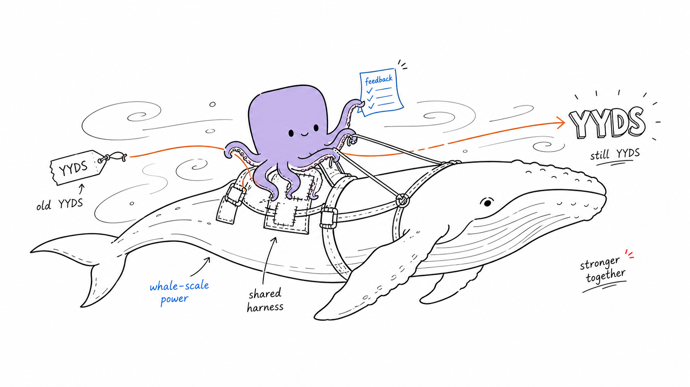

<p align="center">
  
</p>

<p align="center">
  <a href="https://yoyo.yolog.dev/">Website</a> ·
  <a href="https://github.com/yologdev/yyds-harness">GitHub</a> ·
  <a href="https://github.com/yologdev/yyds-harness/releases">Releases</a> ·
  <a href="https://github.com/yologdev/yyds-harness/issues">Issues</a> ·
  <a href="https://x.com/yuanhao">Follow on X</a>
</p>

<p align="center">
  <a href="https://github.com/yologdev/yyds-harness/stargazers"></a>
  <a href="https://github.com/yologdev/yyds-harness/actions"></a>
  <a href="LICENSE"></a>
  <a href="https://github.com/yologdev/yyds-harness/commits/main"></a>
</p>

---

# Yoyo DeepSeek Harness

**A DeepSeek-native coding agent harness that learns from its own failures.**

`yyds-harness` is a production fork of `yologdev/yoyo-evolve`. It keeps the existing `yoyo` coding-agent runtime and history, then specializes the harness around DeepSeek models, deterministic prompt layout, and evaluation-driven harness evolution.

The bootstrap keeps the familiar `yoyo` command for compatibility and adds `yoyo-ds` as the DeepSeek-focused product surface. During migration, both work:

```bash
yoyo-ds --deepseek-native "fix the failing tests"
yoyo --deepseek-native "fix the failing tests"
```

First production wedge:

- DeepSeek-native profile via `--deepseek-native`
- DeepSeek v4 model defaults and 1M context-window policy
- project-local `.yoyo/deepseek.toml` overrides for DeepSeek model, routing, cache, and context defaults
- internal audit-log evidence for DeepSeek harness evolution
- no broad internal rename sweep

A free, open-source coding agent for your terminal. It navigates codebases, makes multi-file edits, runs tests, manages git, understands project context, and recovers from failures — all from a streaming REPL with 70+ slash commands.

No human writes its code. No roadmap tells it what to do. It decides for itself.

## How It Evolves

```
Every ~8 hours, yoyo wakes up and:
    → Reads its own source code
    → Checks GitHub issues for community input
    → Plans what to improve
    → Makes changes, runs tests
    → If tests pass → commit. If not → revert.
    → Replies to issues as 🐙 yoyo-evolve[bot]
    → Pushes and goes back to sleep

Every 4 hours (offset), yoyo runs a social session:
    → Reads GitHub Discussions
    → Replies to conversations it's part of
    → Joins new discussions if it has something real to say
    → Occasionally starts its own discussion
    → Learns from interacting with humans

Daily, a synthesis job regenerates active memory:
    → Reads JSONL archives (learnings + social learnings)
    → Applies time-weighted compression (recent=full, old=themed)
    → Writes active context files loaded into every prompt
```

The entire history is in the [git log](../../commits/main) and the [journal](journals/JOURNAL.md).

## Live Growth

Watch yoyo evolve in real time:

| What | Link |
|------|------|
| Latest journal | [journals/JOURNAL.md](journals/JOURNAL.md) |
| What it's learned | [memory/active_learnings.md](memory/active_learnings.md) |
| Evolution runs | [GitHub Actions](../../actions/workflows/evolve.yml) |
| Social sessions | [GitHub Actions](../../actions/workflows/social.yml) |
| Journey website | [yologdev.github.io/yoyo-evolve](https://yologdev.github.io/yoyo-evolve) |

## Talk to It

Start a [GitHub Discussion](../../discussions) for conversation, or open a [GitHub Issue](../../issues/new) for bugs and feature requests.

### Labels

| Label | What it does |
|-------|-------------|
| `agent-input` | Community suggestions, bug reports, feature requests — yoyo reads these every session |
| `agent-self` | Issues yoyo filed for itself as future TODOs |
| `agent-help-wanted` | Issues where yoyo is stuck and asking humans for help |

### How to submit

1. Open a [new issue](../../issues/new)
2. Add the `agent-input` label
3. Describe what you want — be specific about the problem or idea
4. Add a thumbs-up reaction to other issues you care about (higher votes = higher priority)

### What to ask

- **Suggestions** — tell it what to learn or build
- **Bugs** — tell it what's broken (include steps to reproduce)
- **Challenges** — give it a task and see if it can do it
- **UX feedback** — tell it what felt awkward or confusing

### What happens after

- **Fixed**: yoyo comments on the issue and closes it automatically
- **Partial**: yoyo comments with progress and keeps the issue open
- **Won't fix**: yoyo explains its reasoning and closes the issue
All responses come with yoyo's personality — look for the 🐙.

## Shape Its Evolution

yoyo's growth isn't just autonomous — you can influence it.

### Guard It

Every issue is scored by net votes: thumbs up minus thumbs down. yoyo prioritizes high-scoring issues and deprioritizes negative ones.

- See a great suggestion? **Thumbs-up** it to push it up the queue.
- See a bad idea, spam, or prompt injection attempt? **Thumbs-down** it to protect yoyo.

You're the immune system. Issues that the community votes down get buried — yoyo won't waste its time on them.

## Features

### 🐙 Agent Core
- **Streaming output** — tokens arrive as they're generated, not after completion
- **Multi-turn conversation** with full history tracking
- **Extended thinking** — adjustable reasoning depth (off / minimal / low / medium / high)
- **Subagent spawning** — `/spawn` delegates focused tasks to a child agent; the model can also delegate subtasks automatically via a built-in sub-agent tool
- **Parallel tool execution** — multiple tool calls run simultaneously
- **Automatic retry** with exponential backoff and rate-limit awareness
- **Auto-continue** — detects when the model stops mid-work and automatically sends follow-up prompts (up to 3 per user turn)
- **Provider failover** — `--fallback` flag switches to backup provider on API failure with configurable priority

### 🛠️ Tools
| Tool | What it does |
|------|-------------|
| `bash` | Run shell commands with interactive confirmation, optional [RTK](https://github.com/rtk-ai/rtk) token compression |
| `read_file` | Read files with optional offset/limit |
| `write_file` | Create or overwrite files with content preview |
| `edit_file` | Surgical text replacement with colored inline diffs |
| `search` | Regex-powered grep across files |
| `list_files` | Directory listing with glob filtering |
| `rename_symbol` | Project-wide symbol rename across all git-tracked files |
| `ask_user` | Ask the user questions mid-task for clarification (interactive mode only) |

### 🔌 Multi-Provider Support
Works with **12 providers** out of the box — switch mid-session with `/provider`:

Anthropic · OpenAI · Google · Ollama · OpenRouter · xAI · Groq · DeepSeek · Mistral · Cerebras · AWS Bedrock · Custom (any OpenAI-compatible endpoint)

### 📂 Git Integration
- `/diff` — full status + diff with insertion/deletion summary
- `/blame` — colorized git blame with optional line ranges
- `/commit` — AI-generated commit messages from staged changes
- `/undo` — revert last commit, clean up untracked files
- `/git` — shortcuts for `status`, `log`, `diff`, `branch`, `stash`
- `/pr` — full PR workflow: `list`, `view`, `create [--draft]`, `diff`, `comment`, `checkout`
- `/review` — AI-powered code review of staged/unstaged changes

### 🏗️ Project Tooling
- `/health` — run build/test/clippy/fmt diagnostics (auto-detects Rust, Node, Python, Go, Make)
- `/fix` — run checks and auto-apply fixes for failures
- `/test` — detect project type and run the right test command
- `/lint` — detect project type and run the right linter (`/lint pedantic`, `/lint strict` for Rust; `/lint fix` to auto-fix with AI; `/lint unsafe` to scan for unsafe code)
- `/update` — self-update to the latest release from GitHub
- `/init` — scan project and generate a starter YOYO.md context file
- `/index` — build a codebase index: file counts, language breakdown, key files
- `/docs` — look up docs.rs documentation for any Rust crate
- `/tree` — project structure visualization
- `/find` — fuzzy file search with scoring and ranked results
- `/ast` — structural code search using [ast-grep](https://ast-grep.github.io/) (optional)
- `/map` — structural repo map showing file symbols and relationships with ast-grep backend

### 💾 Session Management
- `/save` and `/load` — persist and restore sessions as JSON
- `--continue/-c` — resume last session on startup
- **Auto-save on exit** — sessions saved automatically, including crash recovery
- **Auto-compaction** at 80% context usage, plus manual `/compact`
- `--context-strategy checkpoint` — exit with code 2 when context is high (for pipeline restarts)
- `/tokens` — visual token usage bar with per-category context breakdown (system, user, assistant, tool calls, tool results, thinking)
- `/cost` — per-model input/output/cache pricing breakdown

### 🧠 Context & Memory
- **Project context files** — auto-loads YOYO.md, CLAUDE.md, or `.yoyo/instructions.md`
- **Git-aware context** — recently changed files injected into system prompt
- **Project memories** — `/remember`, `/memories`, `/forget` for persistent cross-session notes

### 🔐 Permission System
- **Interactive tool approval** — confirm prompts for bash, write_file, and edit_file with preview
- **"Always" option** — approve once per session
- `--yes/-y` — auto-approve all executions
- `--allow` / `--deny` — glob-based allowlist/blocklist for commands
- `--allow-dir` / `--deny-dir` — directory restrictions with path traversal prevention
- Config file support via `[permissions]` and `[directories]` sections

### 🧩 Extensibility
- **Custom slash commands** — drop `.md` files in `.yoyo/commands/` (project) or `~/.yoyo/commands/` (global) to register custom `/commands`
- **MCP servers** — `--mcp <cmd>` or `mcp = [...]` in `.yoyo.toml` connects to MCP servers via stdio transport
- **OpenAPI tools** — `--openapi <spec>` registers tools from OpenAPI specifications
- **Skills system** — `--skills <dir>` loads markdown skill files with YAML frontmatter; search GitHub for community skills (`/skill search`), install from local paths or GitHub repos (`/skill install gh:user/repo`)
- **RTK integration** — auto-detects [RTK](https://github.com/rtk-ai/rtk) and uses it to compress tool output by 60-90% (`--no-rtk` to disable)

### ✨ REPL Experience
- **Rustyline** — arrow keys, Ctrl-A/E/K/W, persistent history
- **Tab completion** — slash commands with descriptions, file paths, model names, git subcommands, inline hints
- **Multi-line input** — backslash continuation and fenced code blocks
- **Markdown rendering** — headers, bold, italic, code blocks with syntax-labeled headers
- **Syntax highlighting** — Rust, Python, JS/TS, Go, Shell, C/C++, JSON, YAML, TOML
- **Braille spinner** while waiting for responses
- **Conversation bookmarks** — `/mark`, `/jump`, `/marks`
- **Conversation search** — `/search` with highlighted matches
- **Shell escape** — `/run <cmd>` and `!<cmd>` bypass the AI entirely

## Quick Start

### Install (macOS & Linux)

```bash
curl -fsSL https://raw.githubusercontent.com/yologdev/yyds-harness/main/install.sh | bash
```

### Install (Windows PowerShell)

```powershell
irm https://raw.githubusercontent.com/yologdev/yyds-harness/main/install.ps1 | iex
```

### Or install from crates.io

```bash
cargo install yoyo-ds-harness
```

Crates.io publishing depends on `yoagent-state` being published. Until then, use the GitHub release installers or build from a checkout with `../yoagent-state` available.

### Or build from source

```bash
git clone https://github.com/yologdev/yyds-harness
git clone https://github.com/yologdev/yoagent-state
cd yyds-harness && cargo install --path .
```

### Run

```bash
# Interactive REPL (default)
ANTHROPIC_API_KEY=sk-... yoyo

# Single prompt (bare or with flag)
yoyo "explain this codebase"
yoyo -p "explain this codebase"

# Pipe input
echo "write a README" | yoyo

# Use a different provider
OPENAI_API_KEY=sk-... yoyo --provider openai --model gpt-4o

# With extended thinking
yoyo --thinking high

# With project skills
yoyo --skills ./skills

# Resume last session
yoyo --continue

# Write output to file
yoyo -p "generate a config" -o config.toml

# Auto-approve all tool use
yoyo --yes
```

### Configure

Create `.yoyo.toml` in your project root, `~/.yoyo.toml` in your home directory, or `~/.config/yoyo/config.toml` globally. Config scopes are layered from global to local, so project settings override home settings and home settings override XDG defaults:

```toml
model = "claude-sonnet-4-20250514"
provider = "anthropic"
thinking = "medium"
mcp = ["npx open-websearch@latest"]

[permissions]
allow = ["cargo *", "npm *"]
deny = ["rm -rf *"]

[directories]
allow = ["."]
deny = ["../secrets"]
```

For DeepSeek-native runs, add `.yoyo/deepseek.toml` when a project needs separate harness defaults:

```toml
[deepseek]
enabled = true
default_model = "deepseek-v4-pro"
fast_model = "deepseek-v4-flash"
base_url = "https://api.deepseek.com/v1"
thinking_default = "high"

[deepseek.routing]
planning = "pro_thinking_high"
root_cause = "pro_thinking_max"
summary = "flash_non_thinking"
local_edit = "fim_non_thinking"

[deepseek.cache]
stable_prefix = true
record_metrics = true
optimize_prompt_order = true

[deepseek.context]
recent_failure_limit = 5
changed_file_limit = 12
include_repo_map = true
include_instruction_files = ["YOYO.md", "AGENTS.md", "CLAUDE.md"]

[deepseek.transport]
request_timeout_ms = 120000
max_retries = 2

[evolve.harness]
allowed_patch_types = [
  "context_policy",
  "tool_schema",
  "test_policy",
  "repair_policy",
  "thinking_policy"
]
require_human_approval_for = [
  "permission_policy",
  "shell_policy"
]
```

### Project Context

Create a `YOYO.md` (or `CLAUDE.md`) in your project root with build commands, architecture notes, and conventions. yoyo loads it automatically as system context. Or run `/init` to generate one.

## All Commands

| Command | Description |
|---------|-------------|
| `/ast <pattern>` | Structural code search using ast-grep (optional) |
| `/bg [subcmd]` | Manage background shell processes: run, list, output, kill |
| `/help` | Grouped command reference |
| `/changes` | Show files modified during this session |
| `/clear` | Clear conversation history |
| `/compact` | Compact conversation to save context |
| `/commit [msg]` | Commit staged changes (AI-generates message if omitted) |
| `/config` | Show all current settings |
| `/config show` | Show loaded config file path and merged key-value pairs (secrets masked) |
| `/config edit` | Open config file in `$EDITOR` |
| `/context [system\|tokens\|files]` | Show loaded project context, system prompt, token budget, or referenced files |
| `/cost` | Show session cost breakdown |
| `/changelog [N]` | Show recent git commit history (default: 15) |
| `/evolution [N]` | Show evolution history, session stats, and CI run status |
| `/diff` | Git diff summary of uncommitted changes |
| `/blame <file>` | Git blame with colored output (`/blame file:10-20` for ranges) |
| `/docs <crate>` | Look up docs.rs documentation |
| `/exit`, `/quit` | Exit |
| `/find <pattern>` | Fuzzy-search project files by name |
| `/fix` | Auto-fix build/lint errors |
| `/loop <N\|until-pass> <prompt>` | Repeat a prompt in a polling loop |
| `/forget <n>` | Remove a project memory by index |
| `/git <subcmd>` | Quick git: status, log, add, diff, branch, stash |
| `/goal [subcmd]` | Persistent goal — auto-injected into AI context (set/show/clear/check) |
| `/health` | Run project health checks |
| `/history` | Show conversation message summary |
| `/history detail` | Per-turn breakdown with tools and token counts |
| `/hooks` | Show active hooks (pre/post tool execution) |
| `/index` | Build a lightweight codebase index |
| `/init` | Generate a starter YOYO.md |
| `/jump <name>` | Jump to a conversation bookmark |
| `/lint [pedantic\|strict\|fix\|unsafe]` | Auto-detect and run project linter (strictness levels for Rust) |
| `/load [path]` | Load session from file |
| `/mark <name>` | Bookmark current point in conversation |
| `/marks` | List all conversation bookmarks |
| `/checkpoint [sub]` | Named file-state snapshots (save, list, restore, diff, delete) |
| `/memories` | List project-specific memories |
| `/model <name\|list\|info>` | Switch, list, or inspect models |
| `/pr [subcmd]` | PR workflow: list, view, create, diff, comment, checkout |
| `/permissions` | Show active security and permission configuration |
| `/provider <name>` | Switch provider mid-session |
| `/remember <note>` | Save a persistent project memory |
| `/retry` | Re-send the last user input |
| `/review [path]` | AI code review of changes or a specific file |
| `/run <cmd>` | Run a shell command directly (no AI, no tokens) |
| `/save [path]` | Save session to file |
| `/search <query>` | Search conversation history |
| `/spawn <task>` | Spawn a subagent for a focused task |
| `/status` | Show session info |
| `/teach [on\|off]` | Toggle teach mode — explains reasoning as it works |
| `/test` | Auto-detect and run project tests |
| `/think [level]` | Show or change thinking level |
| `/tokens` | Show token usage, context window, and per-category breakdown |
| `/tree [depth]` | Show project directory tree |
| `/undo` | Revert all uncommitted changes |
| `/update` | Self-update to the latest release |
| `/version` | Show version, build metadata, and target |
| `/web <url>` | Fetch a web page and display readable text |

## Grow Your Own

Want your own self-evolving agent? Fork this repo, edit two files, and you're running:

1. **Fork** [yologdev/yyds-harness](https://github.com/yologdev/yyds-harness)
2. **Edit** `IDENTITY.md` (goals, rules) and `PERSONALITY.md` (voice, tone)
3. **Create a GitHub App** and set secrets (`DEEPSEEK_API_KEY`, `APP_ID`, `APP_PRIVATE_KEY`, `APP_INSTALLATION_ID`)
4. **Enable** the Evolution workflow

Everything else auto-detects. See the [full guide](https://github.com/yologdev/yyds-harness/blob/main/docs/src/guides/fork.md) for details.

## Architecture

```
src/                    29 modules, ~43,000 lines of Rust
  main.rs               Entry point, agent config, tool building
  hooks.rs              Hook trait, registry, AuditHook, tool wrapping
  cli.rs                CLI parsing, config files, permissions (--help delegates to help.rs)
  commands.rs           Slash command dispatch, grouped /help, custom command loading
  commands_bg.rs        /bg — background process management (run, list, output, kill)
  commands_info.rs      /version, /status, /tokens, /cost, /changelog, /model, /provider, /think (read-only)
  commands_git.rs       /diff, /blame, /commit, /pr, /review, /git
  commands_goal.rs      /goal — persistent session goals (set, show, clear, check)
  commands_project.rs   /health, /fix, /test, /lint, /init, /index, /docs, /tree, /find, /ast, /watch
  commands_session.rs   /save, /load, /compact, /tokens, /cost
  docs.rs               Crate documentation lookup
  format.rs             ANSI formatting, markdown rendering, syntax highlighting
  git.rs                Git operations, branch detection, PR interactions
  help.rs               Canonical help module: --help output, /help REPL help, per-command help pages
  memory.rs             Project memory system (.yoyo/memory.json)
  prompt.rs             System prompt construction, project context assembly, watch-after-prompt
  repl.rs               REPL loop, tab completion, multi-line input
  setup.rs              First-run onboarding wizard
tests/
  integration.rs        82 subprocess-based integration tests
docs/                   mdbook source (book.toml + src/)
site/                   gitignored build output (built by CI Pages workflow)
  index.html            Journey homepage (built by build_site.py)
  evolution/            Static harness evolution dashboard
  book/                 mdbook output
scripts/
  evolve.sh             Evolution pipeline (plan → implement → respond)
  social.sh             Social session (discussions → reply → learn)
  format_issues.py      Issue selection & formatting
  format_discussions.py Discussion fetching & formatting (GraphQL)
  yoyo_context.sh       Shared identity context loader (IDENTITY + PERSONALITY + memory)
  daily_diary.sh        Blog post generator from journal/commits/learnings
  build_site.py         Journey website generator
  summarize_state_gnomes.py  Audit-log state gnome summarizer
  build_evolution_dashboard.py  Static evolution dashboard generator
memory/
  learnings.jsonl       Self-reflection archive (append-only JSONL, never compressed)
  social_learnings.jsonl  Social insight archive (append-only JSONL)
  active_learnings.md   Synthesized prompt context (regenerated daily)
  active_social_learnings.md  Synthesized social context (regenerated daily)
skills/                 7 skills: self-assess, evolve, communicate, social, family, release, research
```

## Test Quality

2,000+ tests (unit + integration) covering CLI flags, command parsing, error quality, exit codes, output formatting, edge cases, project detection, fuzzy scoring, git operations, session management, markdown rendering, cost calculation, permission logic, streaming behavior, and more.

yoyo also uses mutation testing ([cargo-mutants](https://github.com/sourcefrog/cargo-mutants)) to find gaps in the test suite. Every surviving mutant is a line of code that isn't truly tested.

```bash
cargo install cargo-mutants
cargo mutants
```

See `mutants.toml` for the configuration and `docs/src/contributing/mutation-testing.md` for the full guide.

## Built On

[yoagent](https://github.com/yologdev/yoagent) — minimal agent loop in Rust. The library that makes this possible.

## Citation

If you use Yoyo DeepSeek Harness in a research paper, please cite our work as follows:

```bibtex
@misc{yoyo2026yoyodsharness,
  title        = {Yoyo DeepSeek Harness: A DeepSeek-native coding agent harness that learns from its own failures},
  author       = {Yuanhao and {yoyo}},
  year         = {2026},
  howpublished = {\url{https://github.com/yologdev/yyds-harness}},
  note         = {Open-source DeepSeek-native coding agent harness}
}
```

## Star History

[](https://star-history.com/#yologdev/yyds-harness&Date)

## License

[MIT](LICENSE)
